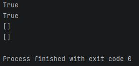
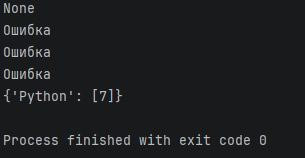
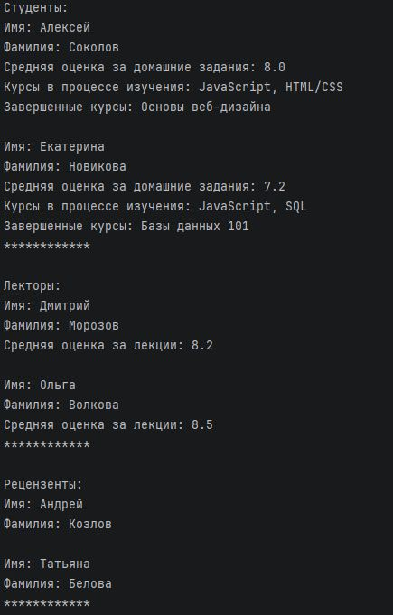
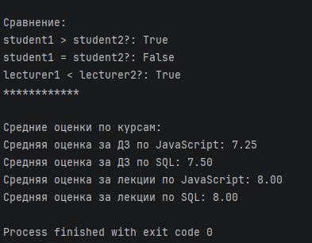

# 3.3. Практическое задание «ООП: наследование, инкапсуляция и полиморфизм». - Андрей Смирнов.
​Привет! Домашняя работа по данной теме является продолжением квиза к предыдущей лекции. Мы продолжим реализовывать логику функционала учебной группы в парадигме ООП.
Удачи!
 
## Задание № 1. Наследование
Исходя из квиза к предыдущему занятию, у нас уже есть [класс преподавателей и класс студентов](https://github.com/netology-code/py-homeworks-basic/blob/new_oop/6.classes/students_and_mentor.py) (вы можете взять этот код за основу или написать свой). Студентов пока оставим без изменения, а вот преподаватели бывают разные, поэтому теперь класс Mentor должен стать родительским классом, а от него нужно реализовать наследование классов Lecturer (лекторы) и Reviewer (эксперты, проверяющие домашние задания). Очевидно, имя, фамилия и список закрепленных курсов логично реализовать на уровне родительского класса. А чем же будут специфичны дочерние классы? Об этом в следующих заданиях. А пока можете проверить, что успешно реализовали дочерние классы
```python
lecturer = Lecturer('Иван', 'Иванов')
reviewer = Reviewer('Пётр', 'Петров')
print(isinstance(lecturer, Mentor)) # True
print(isinstance(reviewer, Mentor)) # True
print(lecturer.courses_attached)    # []
print(reviewer.courses_attached)    # []
```

------


### Ответ:

```python
class Student:
    def __init__(self, name, surname, gender):
        self.name = name
        self.surname = surname
        self.gender = gender
        self.finished_courses = []
        self.courses_in_progress = []
        self.grades = {}

class Mentor:
    def __init__(self, name, surname):
        self.name = name
        self.surname = surname
        self.courses_attached = []

    def rate_hw(self, student, course, grade):
        if isinstance(student, Student) and course in self.courses_attached and course in student.courses_in_progress:
            if course in student.grades:
                student.grades[course] += [grade]
            else:
                student.grades[course] = [grade]
        else:
            return 'Ошибка'

class Lecturer(Mentor):
    pass   # Поскольку в родительском классе есть все неоходимое

class Reviewer(Mentor):
    pass   # Поскольку в родительском классе есть все неоходимое

lecturer = Lecturer('Иван', 'Иванов')
reviewer = Reviewer('Пётр', 'Петров')
print(isinstance(lecturer, Mentor)) # True
print(isinstance(reviewer, Mentor)) # True
print(lecturer.courses_attached)    # []
print(reviewer.courses_attached)    # []

```

Скриншот результата выполнения кода:




------


## Задание № 2. Атрибуты и взаимодействие классов.
В квизе к предыдущей лекции мы реализовали возможность выставлять студентам оценки за домашние задания. Теперь это могут делать только Reviewer (реализуйте такой метод)! А что могут делать лекторы? Получать оценки за лекции от студентов :) Реализуйте метод выставления оценок лекторам у класса Student (оценки по 10-балльной шкале, хранятся в атрибуте-словаре у Lecturer, в котором ключи – названия курсов, а значения – списки оценок). Лектор при этом должен быть закреплен за тем курсом, на который записан студент. 
```python
lecturer = Lecturer('Иван', 'Иванов')
reviewer = Reviewer('Пётр', 'Петров')
student = Student('Алёхина', 'Ольга', 'Ж')
 
student.courses_in_progress += ['Python', 'Java']
lecturer.courses_attached += ['Python', 'C++']
reviewer.courses_attached += ['Python', 'C++']
 
print(student.rate_lecture(lecturer, 'Python', 7))   # None
print(student.rate_lecture(lecturer, 'Java', 8))     # Ошибка
print(student.rate_lecture(lecturer, 'С++', 8))      # Ошибка
print(student.rate_lecture(reviewer, 'Python', 6))   # Ошибка
 
print(lecturer.grades)  # {'Python': [7]}  
```

------


### Ответ:

```python

class Student:
    def __init__(self, name, surname, gender):
        self.name = name
        self.surname = surname
        self.gender = gender
        self.finished_courses = []
        self.courses_in_progress = []
        self.grades = {}

    def rate_lecture(self, lecturer, course, grade):
        if isinstance(lecturer, Lecturer) and course in lecturer.courses_attached and course in self.courses_in_progress:
            if course in lecturer.grades:
                lecturer.grades[course] += [grade]
            else:
                lecturer.grades[course] = [grade]
        else:
            return 'Ошибка'


class Mentor:
    def __init__(self, name, surname):
        self.name = name
        self.surname = surname
        self.courses_attached = []

    def rate_hw(self, student, course, grade):
        if isinstance(student, Student) and course in self.courses_attached and course in student.courses_in_progress:
            if course in student.grades:
                student.grades[course] += [grade]
            else:
                student.grades[course] = [grade]
        else:
            return 'Ошибка'


class Lecturer(Mentor):
    def __init__(self, name, surname):
        super().__init__(name, surname)
        self.grades = {}


class Reviewer(Mentor):
    pass  # пока изменений не требуется


lecturer = Lecturer('Иван', 'Иванов')
reviewer = Reviewer('Пётр', 'Петров')
student = Student('Алёхина', 'Ольга', 'Ж')

student.courses_in_progress += ['Python', 'Java']
lecturer.courses_attached += ['Python', 'C++']
reviewer.courses_attached += ['Python', 'C++']

print(student.rate_lecture(lecturer, 'Python', 7))  # None
print(student.rate_lecture(lecturer, 'Java', 8))  # Ошибка
print(student.rate_lecture(lecturer, 'С++', 8))  # Ошибка
print(student.rate_lecture(reviewer, 'Python', 6))  # Ошибка

print(lecturer.grades)  # {'Python': [7]}  

```

Скриншот результата выполнения кода:




------


## Задание № 3. Полиморфизм и магические методы
1. Перегрузите магический метод ```__str__``` у всех классов. 
 
У проверяющих он должен выводить информацию в следующем виде:
```python
print(some_reviewer)
Имя: Some
Фамилия: Buddy
```
 
У лекторов:
```python
print(some_lecturer)
Имя: Some
Фамилия: Buddy
Средняя оценка за лекции: 9.9
```
 
А у студентов так:
```python
print(some_student)
Имя: Ruoy
Фамилия: Eman
Средняя оценка за домашние задания: 9.9
Курсы в процессе изучения: Python, Git
Завершенные курсы: Введение в программирование
```
 
2. Реализуйте возможность сравнивать (через операторы сравнения) между собой лекторов по средней оценке за лекции и студентов по средней оценке за домашние задания.

------


### Ответ:


```python
from functools import total_ordering

@total_ordering
class Student:
    def __init__(self, name, surname, gender):
        self.name = name
        self.surname = surname
        self.gender = gender
        self.finished_courses = []
        self.courses_in_progress = []
        self.grades = {}

    def rate_lecture(self, lecturer, course, grade):
        if isinstance(lecturer, Lecturer) and course in lecturer.courses_attached and course in self.courses_in_progress:
            if course in lecturer.grades:
                lecturer.grades[course] += [grade]
            else:
                lecturer.grades[course] = [grade]
        else:
            return 'Ошибка'

    def _average_grade(self):
        total = 0
        count = 0
        for grades in self.grades.values():
            total += sum(grades)
            count += len(grades)
        return total / count if count != 0 else 0

    def __str__(self):
        avg = self._average_grade()
        courses_in_progress = ', '.join(self.courses_in_progress)
        finished_courses = ', '.join(self.finished_courses)
        return (f"Имя: {self.name}\n"
                f"Фамилия: {self.surname}\n"
                f"Средняя оценка за домашние задания: {avg:.1f}\n"
                f"Курсы в процессе изучения: {courses_in_progress}\n"
                f"Завершенные курсы: {finished_courses}")

    def __eq__(self, other):
        if not isinstance(other, Student):
            return NotImplemented
        return self._average_grade() == other._average_grade()

    def __lt__(self, other):
        if not isinstance(other, Student):
            return NotImplemented
        return self._average_grade() < other._average_grade()


class Mentor:
    def __init__(self, name, surname):
        self.name = name
        self.surname = surname
        self.courses_attached = []

    def rate_hw(self, student, course, grade):
        if isinstance(student, Student) and course in self.courses_attached and course in student.courses_in_progress:
            if course in student.grades:
                student.grades[course] += [grade]
            else:
                student.grades[course] = [grade]
        else:
            return 'Ошибка'


@total_ordering
class Lecturer(Mentor):
    def __init__(self, name, surname):
        super().__init__(name, surname)
        self.grades = {}

    def _average_grade(self):
        total = 0
        count = 0
        for grades in self.grades.values():
            total += sum(grades)
            count += len(grades)
        return total / count if count != 0 else 0

    def __str__(self):
        avg = self._average_grade()
        return (f"Имя: {self.name}\n"
                f"Фамилия: {self.surname}\n"
                f"Средняя оценка за лекции: {avg:.1f}")

    def __eq__(self, other):
        if not isinstance(other, Lecturer):
            return NotImplemented
        return self._average_grade() == other._average_grade()

    def __lt__(self, other):
        if not isinstance(other, Lecturer):
            return NotImplemented
        return self._average_grade() < other._average_grade()


class Reviewer(Mentor):
    def __str__(self):
        return f"Имя: {self.name}\nФамилия: {self.surname}"
```


## Задание № 4. Полевые испытания
Создайте по 2 экземпляра каждого класса, вызовите все созданные методы, а также реализуйте две функции:
1. для подсчета средней оценки за домашние задания по всем студентам в рамках конкретного курса (в качестве аргументов принимаем список студентов и название курса);
2. для подсчета средней оценки за лекции всех лекторов в рамках курса (в качестве аргумента принимаем список лекторов и название курса).
 

------


### Ответ:


```python
from functools import total_ordering

@total_ordering
class Student:
    def __init__(self, name, surname, gender):
        self.name = name
        self.surname = surname
        self.gender = gender
        self.finished_courses = []
        self.courses_in_progress = []
        self.grades = {}

    def rate_lecture(self, lecturer, course, grade):
        if isinstance(lecturer, Lecturer) and course in lecturer.courses_attached and course in self.courses_in_progress:
            lecturer.grades.setdefault(course, []).append(grade)
        else:
            return 'Ошибка'

    def _average_grade(self):
        total = sum(sum(grades) for grades in self.grades.values())
        count = sum(len(grades) for grades in self.grades.values())
        return total / count if count else 0

    def __str__(self):
        avg = self._average_grade()
        courses_in_progress = ', '.join(self.courses_in_progress) or 'нет'
        finished_courses = ', '.join(self.finished_courses) or 'нет'
        return (f"Имя: {self.name}\n"
                f"Фамилия: {self.surname}\n"
                f"Средняя оценка за домашние задания: {avg:.1f}\n"
                f"Курсы в процессе изучения: {courses_in_progress}\n"
                f"Завершенные курсы: {finished_courses}")

    def __eq__(self, other):
        if not isinstance(other, Student):
            return NotImplemented
        return self._average_grade() == other._average_grade()

    def __lt__(self, other):
        if not isinstance(other, Student):
            return NotImplemented
        return self._average_grade() < other._average_grade()


class Mentor:
    def __init__(self, name, surname):
        self.name = name
        self.surname = surname
        self.courses_attached = []


@total_ordering
class Lecturer(Mentor):
    def __init__(self, name, surname):
        super().__init__(name, surname)
        self.grades = {}

    def _average_grade(self):
        total = sum(sum(grades) for grades in self.grades.values())
        count = sum(len(grades) for grades in self.grades.values())
        return total / count if count else 0

    def __str__(self):
        avg = self._average_grade()
        return (f"Имя: {self.name}\n"
                f"Фамилия: {self.surname}\n"
                f"Средняя оценка за лекции: {avg:.1f}")

    def __eq__(self, other):
        if not isinstance(other, Lecturer):
            return NotImplemented
        return self._average_grade() == other._average_grade()

    def __lt__(self, other):
        if not isinstance(other, Lecturer):
            return NotImplemented
        return self._average_grade() < other._average_grade()


class Reviewer(Mentor):
    def rate_hw(self, student, course, grade):
        if isinstance(student, Student) and course in self.courses_attached and course in student.courses_in_progress:
            student.grades.setdefault(course, []).append(grade)
        else:
            return 'Ошибка'

    def __str__(self):
        return f"Имя: {self.name}\nФамилия: {self.surname}"


def average_hw_grade(students, course):
    grades = []
    for student in students:
        if course in student.grades:
            grades.extend(student.grades[course])
    return sum(grades) / len(grades) if grades else 0

def average_lecture_grade(lecturers, course):
    grades = []
    for lecturer in lecturers:
        if course in lecturer.grades:
            grades.extend(lecturer.grades[course])
    return sum(grades) / len(grades) if grades else 0


# Создание экземпляров:
student1 = Student('Алексей', 'Соколов', 'муж')
student1.courses_in_progress = ['JavaScript', 'HTML/CSS']
student1.finished_courses = ['Основы веб-дизайна']

student2 = Student('Екатерина', 'Новикова', 'жен')
student2.courses_in_progress = ['JavaScript', 'SQL']
student2.finished_courses = ['Базы данных 101']

lecturer1 = Lecturer('Дмитрий', 'Морозов')
lecturer1.courses_attached = ['JavaScript', 'HTML/CSS']

lecturer2 = Lecturer('Ольга', 'Волкова')
lecturer2.courses_attached = ['JavaScript', 'SQL']

reviewer1 = Reviewer('Андрей', 'Козлов')
reviewer1.courses_attached = ['JavaScript', 'HTML/CSS']

reviewer2 = Reviewer('Татьяна', 'Белова')
reviewer2.courses_attached = ['JavaScript', 'SQL']

# Выставление оценок студентам:
reviewer1.rate_hw(student1, 'JavaScript', 7)
reviewer1.rate_hw(student1, 'JavaScript', 8)
reviewer1.rate_hw(student1, 'HTML/CSS', 9)
reviewer1.rate_hw(student2, 'JavaScript', 5)

reviewer2.rate_hw(student2, 'JavaScript', 9)
reviewer2.rate_hw(student2, 'SQL', 8)
reviewer2.rate_hw(student2, 'SQL', 7)

# Выставление оценок лекторам:
student1.rate_lecture(lecturer1, 'JavaScript', 8)
student1.rate_lecture(lecturer1, 'JavaScript', 9)
student1.rate_lecture(lecturer1, 'HTML/CSS', 10)

student2.rate_lecture(lecturer1, 'JavaScript', 6)
student2.rate_lecture(lecturer2, 'JavaScript', 9)
student2.rate_lecture(lecturer2, 'SQL', 8)

# Вывод информации:
print("Студенты:")
print(student1)
print()
print(student2)
print("************")
print()


print("Лекторы:")
print(lecturer1)
print()
print(lecturer2)
print("************")
print()


print("Рецензенты:")
print(reviewer1)
print()
print(reviewer2)
print("************")
print()


# Сравнение:
print("Сравнение:")
print(f"student1 > student2?: {student1 > student2}")
print(f"student1 = student2?: {student1 == student2}")
print(f"lecturer1 < lecturer2?: {lecturer1 < lecturer2}")
print("************")
print()

# Использование функций:
students = [student1, student2]
lecturers = [lecturer1, lecturer2]

print("Средние оценки по курсам:")
print(f"Средняя оценка за ДЗ по JavaScript: {average_hw_grade(students, 'JavaScript'):.2f}")
print(f"Средняя оценка за ДЗ по SQL: {average_hw_grade(students, 'SQL'):.2f}")
print(f"Средняя оценка за лекции по JavaScript: {average_lecture_grade(lecturers, 'JavaScript'):.2f}")
print(f"Средняя оценка за лекции по SQL: {average_lecture_grade(lecturers, 'SQL'):.2f}")
```

Скриншоты результата выполнения кода:







------

 
## Как сдавать задачи
Пишите код в IDE: PyCharm Community Edition или GigaIDE .  
- Почему лучше работать в IDE? — Ускоряет работу, есть подсветка ошибок, отладка по шагам.  
- Для более подробной информации изучите [инструкцию по работе с Pycharm](https://github.com/netology-code/guides/blob/master/python/Pycharm.md).  
- Опирайтесь на принятые [правила оформления кода](https://github.com/netology-code/codestyle/tree/master/python), чтобы выработать привычку писать профессионально. При несоблюдении принятого стиля домашние задания могут быть отправлены на доработку. 
 
1. Инициализируйте на своём компьютере пустой Git-репозиторий
2. Добавьте в этот же каталог необходимые файлы
3. Сделайте необходимые коммиты
4. Создайте публичный репозиторий на GitHub и свяжите свой локальный репозиторий с удалённым
5. Сделайте пуш (удостоверьтесь, что ваш код появился на GitHub)
6. Ссылку на ваш проект отправьте в личном кабинете на сайте [netology.ru](http://netology.ru/)
7. Задачи, отмеченные как необязательные, можно не сдавать, это не повлияет на получение зачета (в этом ДЗ все задачи являются обязательными)
8. Вы можете задавать вопросы по решению задач, но мы не сможем проверить или помочь, если вы пришлете:
* архивы;
* скриншоты кода;
* теоретический рассказ о возникших проблемах.

## Критерии оценки домашнего задания

### Зачёт
#### Задание №1 (Наследование):
- Созданы классы Lecturer и Reviewer, наследующие от Mentor.
- Проверка через isinstance() возвращает True.
- Атрибуты courses_attached корректно наследуются и инициализируются пустым списком.

#### Задание №2 (Атрибуты и взаимодействие классов):
- У Reviewer реализован метод выставления оценок студентам.
- У Student реализован метод rate_lecture(), который:
  - Работает только для лекторов (Lecturer).
  - Проверяет, что лектор прикреплен к курсу студента.
  - Записывает оценки в словарь grades лектора.
  - Ошибки обрабатываются корректно (как в примере).

#### Задание №3 (Полиморфизм и магические методы):
- Перегружен __str__ для всех классов (формат вывода соответствует условию).
- Реализовано сравнение (>, <, ==) лекторов и студентов по средней оценке.

#### Задание №4 (Полевые испытания):
- Созданы по 2 экземпляра каждого класса.
- Проверены все методы (включая новые).
- Реализованы 2 функции:
  - Подсчет средней оценки студентов по курсу.
  - Подсчет средней оценки лекторов по курсу.

### На доработку
- Если хотя бы один из пунктов не выполнен или работает некорректно.
- Если код не соответствует PEP 8 (отступы, названия переменных, Docstrings и т. д.).
- Если сравнение (>, <, ==) не работает или работает неверно.
- Если функции для подсчета средних оценок не учитывают все переданные объекты или курс.
