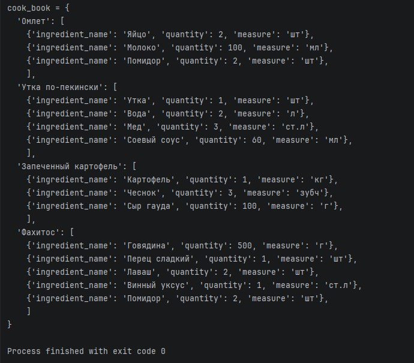
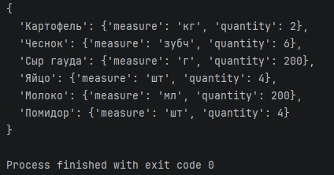

# 3.4. Домашнее задание к лекции «Открытие и чтение файла, запись в файл». - Андрей Смирнов.

Напишите программу для кулинарной книги.

Список рецептов хранится в отдельном файле в следующем формате:
```
Название блюда
Количество ингредиентов в блюде
Название ингредиента | Количество | Единица измерения
Название ингредиента | Количество | Единица измерения
...
```

Пример([файл recipes.txt](./assets/3_4/recipes.txt)):
```
Омлет
3
Яйцо | 2 | шт
Молоко | 100 | мл
Помидор | 2 | шт

Утка по-пекински
4
Утка | 1 | шт
Вода | 2 | л
Мед | 3 | ст.л
Соевый соус | 60 | мл

Запеченный картофель
3
Картофель | 1 | кг
Чеснок | 3 | зубч
Сыр гауда | 100 | г

Фахитос
5
Говядина | 500 | г
Перец сладкий | 1 | шт
Лаваш | 2 | шт
Винный уксус | 1 | ст.л
Помидор | 2 | шт
```

* В одном файле может быть произвольное количество блюд.
* Читать список рецептов из этого файла.
* Соблюдайте кодстайл, разбивайте новую логику на функции и не используйте глобальных переменных.

## Задача №1

Должен получится следующий словарь
```python
cook_book = {
  'Омлет': [
    {'ingredient_name': 'Яйцо', 'quantity': 2, 'measure': 'шт.'},
    {'ingredient_name': 'Молоко', 'quantity': 100, 'measure': 'мл'},
    {'ingredient_name': 'Помидор', 'quantity': 2, 'measure': 'шт'}
    ],
  'Утка по-пекински': [
    {'ingredient_name': 'Утка', 'quantity': 1, 'measure': 'шт'},
    {'ingredient_name': 'Вода', 'quantity': 2, 'measure': 'л'},
    {'ingredient_name': 'Мед', 'quantity': 3, 'measure': 'ст.л'},
    {'ingredient_name': 'Соевый соус', 'quantity': 60, 'measure': 'мл'}
    ],
  'Запеченный картофель': [
    {'ingredient_name': 'Картофель', 'quantity': 1, 'measure': 'кг'},
    {'ingredient_name': 'Чеснок', 'quantity': 3, 'measure': 'зубч'},
    {'ingredient_name': 'Сыр гауда', 'quantity': 100, 'measure': 'г'},
    ]
  }
```


------


### Ответ:

```python
def create_cookbook(file_path):
    with open(file_path, 'r', encoding='utf-8') as file:
        lines = [line.strip() for line in file if line.strip() != '']

    cookbook = {}
    i = 0

    while i < len(lines):
        dish_name = lines[i]
        i += 1
        ingredients_count = int(lines[i])
        i += 1

        ingredients_list = []
        for _ in range(ingredients_count):
            ingredient_line = lines[i]
            i += 1
            name, quantity_str, measure = [part.strip() for part in ingredient_line.split('|')]
            quantity = int(quantity_str)
            ingredients_list.append({
                'ingredient_name': name,
                'quantity': quantity,
                'measure': measure
            })

        cookbook[dish_name] = ingredients_list

    return cookbook


def print_cookbook(cookbook):
    print("cook_book = {")
    dishes = list(cookbook.keys())
    for idx, dish in enumerate(dishes):
        print(f"  '{dish}': [")
        ingredients = cookbook[dish]
        for ing in ingredients:
            ing_str = (
                f"    {{'ingredient_name': '{ing['ingredient_name']}', "
                f"'quantity': {ing['quantity']}, 'measure': '{ing['measure']}'}}"
            )
            print(ing_str + ",")
        if idx == len(dishes) - 1:
            print("    ]")
        else:
            print("    ],")
    print("}")


if __name__ == '__main__':
    cook_book = create_cookbook('recipes.txt')
    print_cookbook(cook_book)

```


Скриншот результата выполнения кода:





------


## Задача №2

Нужно написать функцию, которая на вход принимает список блюд из cook_book и количество персон для кого мы будем готовить
```python
get_shop_list_by_dishes(dishes, person_count)
```
На выходе мы должны получить словарь с названием ингредиентов и его количества для блюда.
Например, для такого вызова
```python
get_shop_list_by_dishes(['Запеченный картофель', 'Омлет'], 2)
```
Должен быть следующий результат:
```
{
  'Картофель': {'measure': 'кг', 'quantity': 2},
  'Молоко': {'measure': 'мл', 'quantity': 200},
  'Помидор': {'measure': 'шт', 'quantity': 4},
  'Сыр гауда': {'measure': 'г', 'quantity': 200},
  'Яйцо': {'measure': 'шт', 'quantity': 4},
  'Чеснок': {'measure': 'зубч', 'quantity': 6}
}
```
**Обратите внимание, что ингредиенты могут повторяться**

------


### Ответ:

```python
def create_cookbook(file_path):
    with open(file_path, 'r', encoding='utf-8') as file:
        lines = [line.strip() for line in file if line.strip() != '']

    cookbook = {}
    i = 0

    while i < len(lines):
        dish_name = lines[i]
        i += 1
        ingredients_count = int(lines[i])
        i += 1

        ingredients_list = []
        for _ in range(ingredients_count):
            ingredient_line = lines[i]
            i += 1
            name, quantity_str, measure = [part.strip() for part in ingredient_line.split('|')]
            quantity = int(quantity_str)
            ingredients_list.append({
                'ingredient_name': name,
                'quantity': quantity,
                'measure': measure
            })

        cookbook[dish_name] = ingredients_list

    return cookbook


def print_cookbook(cookbook):
    print("cook_book = {")
    dishes = list(cookbook.keys())
    for idx, dish in enumerate(dishes):
        print(f"  '{dish}': [")
        ingredients = cookbook[dish]
        for ing in ingredients:
            ing_str = (
                f"    {{'ingredient_name': '{ing['ingredient_name']}', "
                f"'quantity': {ing['quantity']}, 'measure': '{ing['measure']}'}}"
            )
            print(ing_str + ",")
        if idx == len(dishes) - 1:
            print("    ]")
        else:
            print("    ],")
    print("}")


def get_shop_list_by_dishes(dishes, person_count):
    shop_list = {}
    for dish in dishes:
        if dish in cook_book:
            for ingredient in cook_book[dish]:
                name = ingredient['ingredient_name']
                quantity = ingredient['quantity'] * person_count
                measure = ingredient['measure']
                if name in shop_list:
                    shop_list[name]['quantity'] += quantity
                else:
                    shop_list[name] = {'measure': measure, 'quantity': quantity}
    return shop_list


def print_shop_list(shop_list):
    print("{")
    items = list(shop_list.items())
    for i, (name, data) in enumerate(items):
        line = f"  '{name}': {{'measure': '{data['measure']}', 'quantity': {data['quantity']}}}"
        if i < len(items) - 1:
            line += ","
        print(line)
    print("}")


if __name__ == '__main__':
    cook_book = create_cookbook('recipes.txt')
    # print_cookbook(cook_book)
    result = get_shop_list_by_dishes(['Запеченный картофель', 'Омлет'], 2)
    print_shop_list(result)

```


Скриншот результата выполнения кода:





------


## Задача 

В папке лежит некоторое количество файлов. Считайте, что их количество и имена вам заранее известны, пример для выполнения домашней работы можно взять [тут](./assets/3_4/)  

Необходимо объединить их в один по следующим правилам:
1. Содержимое исходных файлов в результирующем файле должно быть отсортировано по количеству строк в них (то есть первым нужно записать файл с наименьшим количеством строк, а последним - с наибольшим)
2. Содержимое файла должно предваряться служебной информацией на 2-х строках: имя файла и количество строк в нем

**Пример**
Даны файлы: 
1.txt
```
Строка номер 1 файла номер 1
Строка номер 2 файла номер 1
```

2.txt
```
Строка номер 1 файла номер 2
```

Итоговый файл: 
```
2.txt
1
Строка номер 1 файла номер 2
1.txt
2
Строка номер 1 файла номер 1
Строка номер 2 файла номер 1
```

------


### Ответ:

```python
def merge_files(file_names, output_file):
    file_info = []
    for name in file_names:
        with open(name, 'r', encoding='utf-8') as f:
            lines = f.readlines()
        line_count = len(lines)
        file_info.append((name, line_count, lines))

    file_info.sort(key=lambda x: x[1])

    with open(output_file, 'w', encoding='utf-8') as out:
        for name, count, lines in file_info:
            out.write(name + '\n')
            out.write(str(count) + '\n')
            for line in lines:
                out.write(line)
            if lines and not lines[-1].endswith('\n'):
                out.write('\n')

if __name__ == '__main__':
    files = ['1.txt', '2.txt', '3.txt']
    merge_files(files, 'merged_file.txt')

```


[Получившийся файл merged_file.txt](./assets/3_4/merged_file.txt)

Содержимое полученного файла:

```
2.txt
1
Тревога началась в тринадцать часов ноль две минуты. 
1.txt
8
Начальник  полиции
лично позвонил в шестнадцатый участок. А спустя  одну минуту тридцать секунд
в дежурке и других комнатах нижнего этажа раздались звонки
     Когда Иенсен  --  комиссар  шестнадцатого  участка --  вышел  из своего
кабинета,  звонки еще  не смолкли. Иенсен был мужчина средних лет,  обычного
сложения, с лицом плоским и невыразительным. На последней ступеньке винтовой
лестницы  он задержался  и  обвел взглядом помещение дежурки. Затем поправил
галстук и проследовал к машине.
3.txt
9
     В  это время  дня  машины текли сплошным  блестящим  потоком,  а  среди
потока, будто  колонны из бетона  и стекла, высились  здания. Здесь,  в мире
резких граней,  люди  на тротуарах  выглядели  несчастными и  неприкаянными.
Одеты они были хорошо, но как-то удивительно походили друг на друга и все до
одного спешили. Они шли нестройными  вереницами, широко разливались, завидев
красный  светофор или  металлический  блеск кафе-автоматов.  Они непрестанно
озирались по сторонам и теребили портфели и сумочки.
     Полицейские  машины  с  включенными  сиренами  пробивались  сквозь  эту
толчею.
```

------