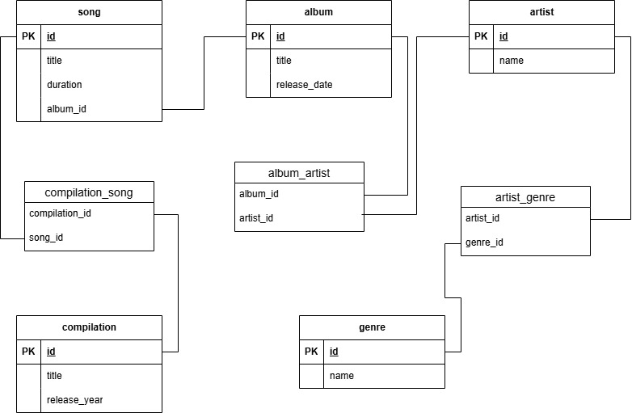
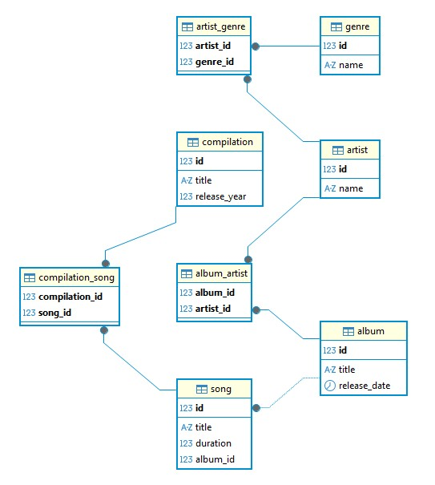

# 4.2. Домашнее задание к лекции «Работа с SQL. Создание БД». - Андрей Смирнов.
 

## Задание

### Обязательная часть

Будем развивать схему для музыкального сервиса.

Ранее существовало ограничение, что каждый исполнитель поёт строго в одном жанре, пора его убрать. Исполнители могут петь в разных жанрах, как и одному жанру могут принадлежать несколько исполнителей.

Аналогичное ограничение было и с альбомами у исполнителей — альбом мог выпустить только один исполнитель. Теперь альбом могут выпустить несколько исполнителей вместе. Как и исполнитель может принимать участие во множестве альбомов.

С треками ничего не меняем, всё так же трек принадлежит строго одному альбому.

Но появилась новая сущность — сборник. Сборник имеет название и год выпуска. В него входят различные треки из разных альбомов.

_Обратите внимание_: один и тот же трек может присутствовать в разных сборниках.

Задание состоит из двух частей

1. Спроектировать и нарисовать схему, как в [первой домашней работе](../01-introduction). Прислать изображение со схемой.
2. Написать SQL-запросы, создающие спроектированную БД. Прислать ссылку на файл, содержащий SQL-запросы.

_Примечание:_ можно прислать сначала схему, получить подтверждение, что схема верная, и после этого браться за написание запросов.


------


### Ответ:

Схема БД в drawio:




Схема БД в dbeaver:




SQL-код для создания данной БД:

```sql

CREATE TABLE artist (
    id SERIAL PRIMARY KEY,
    name VARCHAR(255) NOT NULL
);

CREATE TABLE genre (
    id SERIAL PRIMARY KEY,
    name VARCHAR(255) NOT NULL
);

CREATE TABLE artist_genre (
    artist_id INT REFERENCES artist(id) ON DELETE CASCADE,
    genre_id INT REFERENCES genre(id) ON DELETE CASCADE,
    PRIMARY KEY (artist_id, genre_id)
);

CREATE TABLE album (
    id SERIAL PRIMARY KEY,
    title VARCHAR(255) NOT NULL,
    release_date DATE NOT NULL
);

CREATE TABLE album_artist (
    album_id INT REFERENCES album(id) ON DELETE CASCADE,
    artist_id INT REFERENCES artist(id) ON DELETE CASCADE,
    PRIMARY KEY (album_id, artist_id)
);

CREATE TABLE song (
    id SERIAL PRIMARY KEY,
    title VARCHAR(255) NOT NULL,
    duration INT NOT NULL, 
    album_id INT NOT NULL REFERENCES album(id) ON DELETE CASCADE
);

CREATE TABLE compilation (
    id SERIAL PRIMARY KEY,
    title VARCHAR(255) NOT NULL,
    release_year INT NOT NULL
);

CREATE TABLE compilation_song (
    compilation_id INT REFERENCES compilation(id) ON DELETE CASCADE,
    song_id INT REFERENCES song(id) ON DELETE CASCADE,
    PRIMARY KEY (compilation_id, song_id)
);

```

Для удобства sql-файл ([music_db.sql](./assets/4_2/music_db.sql))

------


### Дополнительное (необязательное) задание

Спроектировать отношение или схему из нескольких отношений «Сотрудник». У каждого сотрудника есть следующие параметры:

1. Имя.
2. Отдел.
3. Начальник (ссылка на начальника).

_Примечание:_ начальник — тоже сотрудник. Отдел можно хранить строкой, можно идентификатором — не принципиально.

Необходимо написать SQL-запрос, создающий таблицу «Сотрудник», и прислать ссылку на файл с этим запросом.