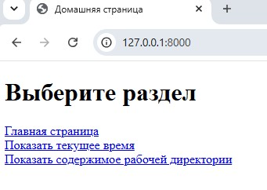
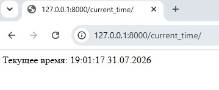
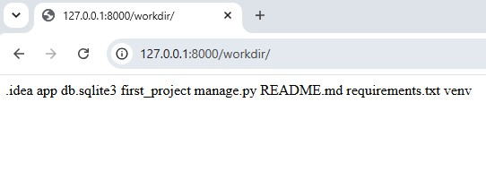

# 6.1. # Django. Работа с проектом и приложением. - Андрей Смирнов.

## Задание

Вам дана заготовка с Django проектом. В проект уже добавлено 1 приложение – `app`.

Вам необходимо реализовать 3 view функции и настроить для них правильные урлы.

- `/` - домашняя страница, содержит список доступных страниц;
- `current_time/` - показывает текущее время в любом удобном вам формате;
- `workdir/` – выводит содержимое [рабочей директории](https://ru.wikipedia.org/wiki/%D0%A0%D0%B0%D0%B1%D0%BE%D1%87%D0%B8%D0%B9_%D0%BA%D0%B0%D1%82%D0%B0%D0%BB%D0%BE%D0%B3).

В первую очередь обратите внимание на файл [urls.py](./first_project/urls.py). В нем задаются пути ко view-функциям, которые отвечают по соответствующим запросам.

Приложение `app` уже добавлено в проект и включено в `INSTALLED_APPS` (обязательно убедитесь в этом, проверив файл с настройками).

`home_view` использует шаблон для генерации контента страницы. Шаблоны мы еще не изучали, это материал дальнейших лекций. Поэтому ориентируйтесь на подсказки, часть кода уже написано, вам нужно вписать недостающее 🙂.

Вам нужно вписать свой код в следующие файлы:

- [urls.py](./first_project/urls.py)
- [views.py](./app/views.py)

В случае возникновения ошибок, не забывайте использовать рекомендации по отладке вашего Django-проекта из лекции.

## Подсказки

- Для получения списка файлов в рабочей директории вам поможет функция `listdir` https://docs.python.org/3.7/library/os.html#os.listdir;

- для получения текущего времени используйте модуль `datetime`: https://docs.python.org/3.7/library/datetime.html.

## Документация по проекту

Для запуска проекта необходимо:

Установить зависимости:

```bash
pip install -r requirements.txt
```

Выполнить команду:

```bash
python manage.py runserver
```

------


### Ответ:


Содержимое дополненного urls.py и сам файл [urls.py](./assets/6_1/urls.py):

```python
from django.contrib import admin
from django.urls import path
from app.views import home_view, time_view, workdir_view


urlpatterns = [
    path('', home_view, name='home'),
    # Раскомментируйте код, чтобы данные урлы 
    # обрабатывались Django
    path('current_time/', time_view, name='time'),
    path('workdir/', workdir_view, name='workdir'),
    path('admin/', admin.site.urls),
]
```


Содержимое дополненного views.py и сам файл [views.py](./assets/6_1/views.py):

```python
from django.http import HttpResponse
from django.shortcuts import render, reverse
import datetime, os

def home_view(request):
    template_name = 'app/home.html'
    # впишите правильные адреса страниц, используя
    # функцию `reverse`
    pages = {
        'Главная страница': reverse('home'),
        'Показать текущее время': reverse('time'),
        'Показать содержимое рабочей директории': reverse('workdir')
    }
    
    # context и параметры render менять не нужно
    # подбробнее о них мы поговорим на следующих лекциях
    context = {
        'pages': pages
    }
    return render(request, template_name, context)


def time_view(request):
    # обратите внимание – здесь HTML шаблона нет, 
    # возвращается просто текст
    current_time = datetime.datetime.now().strftime('%H:%M:%S %d.%m.%Y')
    msg = f'Текущее время: {current_time}'
    return HttpResponse(msg)


def workdir_view(request):
    # по аналогии с `time_view`, напишите код,
    # который возвращает список файлов в рабочей 
    # директории
    files = os.listdir('.')
    file_list = '\n'.join(files)
    return HttpResponse(file_list)
```


Демонстрация работы проекта:

Главная страница:




Страница current_time:




Страница workdir:




------
