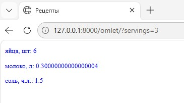
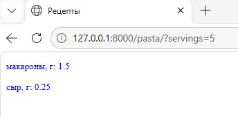
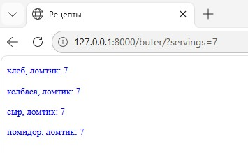

# 6.2. # Django. Обработка запросов и шаблоны. - Андрей Смирнов.

# Рецепты

## Задание

Ваша задача — написать простой сервис-помощник для приготовления блюд.

Сервис знает некоторое количество рецептов (см. файл `calculator/views.py` —- переменная `DATA`).

На запрос вида `/omlet/` должен отобразиться список ингредиентов и их количество для приготовления омлета. Аналогично для запроса вида `/pasta/` — список ингредиентов и их количество для приготовления макарон с сыром. И т. д.

Например:

```
http://127.0.0.1:8000/omlet/

# Ответ
яйца, шт: 2
молоко, л: 0.1
соль, ч.л.: 0.5
```

По умолчанию сервис сообщает количество ингредиентов на одну порцию. Но если передать опциональный параметр `servings` (целое положительное число), то сервис должен выдать количество ингредиентов на указанное число порций.

Например:

```
http://127.0.0.1:8000/omlet/?servings=4

# Ответ
яйца, шт: 8
молоко, л: 0.4
соль, ч.л.: 2.0
```

### Особенности реализации

- `servings` — необязательный параметр, а значит его может не быть в `requests.GET`;
- параметры из `requests.GET` всегда являются строкой, для умножения надо конвертировать в число;
- контекст должен выглядеть примерно так:

```python
context = {
  'recipe': {
    'ингредиент1': количество1,
    'ингредиент2': количество2,
  }
}
```


------


### Ответ:


Содержимое urls.py и сам файл [urls.py](./assets/6_2/urls.py):

```python
from django.urls import path
from calculator import views

urlpatterns = [
    path('', views.recipe_view, {'dish_name': 'omlet'}, name='home'),
    path('omlet/', views.recipe_view, {'dish_name': 'omlet'}, name='omlet'),
    path('pasta/', views.recipe_view, {'dish_name': 'pasta'}, name='pasta'),
    path('buter/', views.recipe_view, {'dish_name': 'buter'}, name='buter'),
]
```


Содержимое views.py и сам файл [views.py](./assets/6_2/views.py):

```python
from django.shortcuts import render

DATA = {
    'omlet': {
        'яйца, шт': 2,
        'молоко, л': 0.1,
        'соль, ч.л.': 0.5,
    },
    'pasta': {
        'макароны, г': 0.3,
        'сыр, г': 0.05,
    },
    'buter': {
        'хлеб, ломтик': 1,
        'колбаса, ломтик': 1,
        'сыр, ломтик': 1,
        'помидор, ломтик': 1,
    },
    # можете добавить свои рецепты ;)
}

# Напишите ваш обработчик. Используйте DATA как источник данных
# Результат - render(request, 'calculator/index.html', context)
# В качестве контекста должен быть передан словарь с рецептом:
# context = {
#   'recipe': {
#     'ингредиент1': количество1,
#     'ингредиент2': количество2,
#   }
# }
def recipe_view(request, dish_name):

    recipe = DATA.get(dish_name)

    if not recipe:
        return render(request, 'calculator/index.html', {'recipe': {}})

    servings = request.GET.get('servings')
    if servings is not None:
        try:
            servings = int(servings)
            if servings < 1:
                servings = 1
        except ValueError:
            servings = 1
    else:
        servings = 1

    scaled_recipe = {}
    for ingredient, amount in recipe.items():
        if isinstance(amount, (int, float)):
            scaled_recipe[ingredient] = amount * servings
        else:
            scaled_recipe[ingredient] = amount

    context = {
        'recipe': scaled_recipe,
        'dish_name': dish_name,
        'servings': servings,
    }

    return render(request, 'calculator/index.html', context)
```

Содержимое шаблона index.html и сам файл [index.html](./assets/6_2/index.html):

```html
<!DOCTYPE html>
<html lang="ru">
<head>
    <meta charset="UTF-8">
    <title>Рецепты</title>
    <style>
        body {
            color: blue;
            font-family: "Times New Roman", Times, serif;
            font-size: 10pt;
        }
    </style>
</head>
<body>
    
        <p>{{ ingredient }}: {{ amount }}</p>
    
        <p>Такого рецепта не знаю :(</p>
    
</body>
</html>
```


Демонстрация работы проекта:

Рецепт для омлета:




Рецепт для пасты:




Рецепт для бутерброда:




------