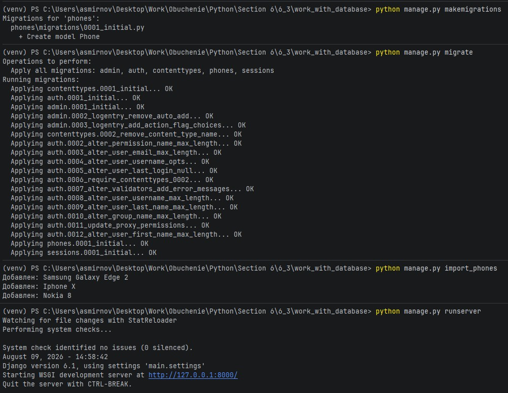
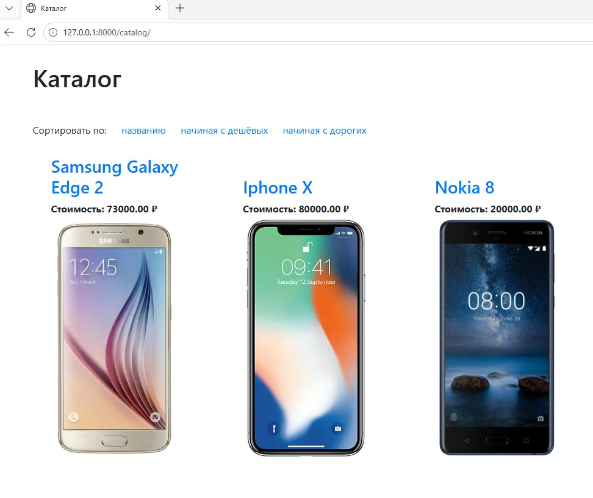
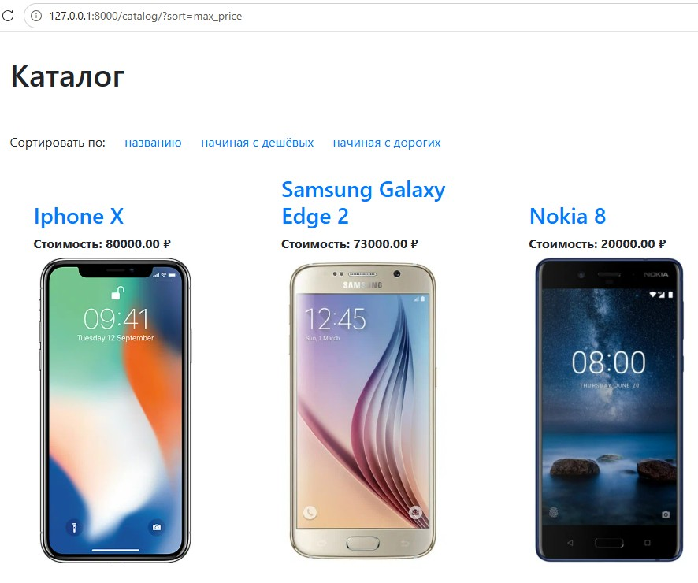

# 6.3. # Django ORM part 1. - Андрей Смирнов.

# Выгрузка каталога товаров из csv-файла с сохранением всех позиций в базе данных

## Задание

Есть некоторый [csv-файл](./phones.csv), который выгружается с сайта-партнера. Этот сайт занимается продажей телефонов.

Мы же являемся их региональными представителями, поэтому нам необходимо взять данные из этого файла и отобразить их на нашем сайте на странице каталога, с их предварительным сохранением в базу данных.

## Реализация

Что необходимо сделать

- В файле `models.py` нашего приложения создаём модель Phone с полями `id`, `name`, `price`, `image`, `release_date`, `lte_exists` и `slug`. Поле `id` — должно быть основным ключом модели.
- Значение поля `slug` должно устанавливаться слагифицированным значением поля `name`.
- Написать скрипт для переноса данных из csv-файла в модель `Phone`.
  Скрипт необходимо разместить в файле `import_phones.py` в методе `handle(self, *args, **options)`.
  Подробнее про подобные скрипты (django command) можно почитать [здесь](https://docs.djangoproject.com/en/3.2/howto/custom-management-commands/) и [здесь](https://habr.com/ru/post/415049/).
- При запросе `<имя_сайта>/catalog` должна открываться страница с отображением всех телефонов.
- При запросе `<имя_сайта>/catalog/iphone-x` должна открываться страница с отображением информации по телефону. `iphone-x` — это для примера, это значние берётся из `slug`.
- В каталоге необходимо добавить возможность менять порядок отображения товаров: по названию в алфавитном порядке и по цене по убыванию и по возрастанию.

Шаблоны подготовлены, ваша задача — ознакомиться с ними и корректно написать логику.

## Ожидаемый результат


## Подсказка

Для переноса данных из файла в модель можно выбрать один из способов:

- воспользоваться стандартной библиотекой языка Python: `csv` (рекомендуется).
- построчно пройтись по файлу и для каждой строки сделать соответствующую запись в БД.

Для реализации сортировки можно брать параметр `sort` из `request.GET`.

Пример запросов:

- `<имя_сайта>/catalog?sort=name` — сортировка по названию;
- `<имя_сайта>/catalog?sort=min_price` — сначала отображать дешёвые.

## Документация по проекту

Для запуска проекта необходимо

Установить зависимости:

```bash
pip install -r requirements.txt
```

Выполнить следующие команды:

- Команда для создания миграций приложения для базы данных

```bash
python manage.py migrate
```

- Команда для загрузки данных из csv в БД

```bash
python manage.py import_phones
```

- Команда для запуска приложения

```bash
python manage.py runserver
```

- При создании моделей или их изменении необходимо выполнить следующие команды:

```bash
python manage.py makemigrations
python manage.py migrate
```


------


### Ответ:

Изменения в прокте были выполнены в следующих 3 файлах - `phones/models.py`, `phones\management\commands\import_phones.py`, `phones/views.py` (достаточно поместить их в исходный проект, запустить сервер PostgreSQL, создать БД с именем `netology_import_phones` и указать корректный пароль юзера postgres в `main/settings.py`):


Содержимое `phones/models.py` и сам файл [models.py](./assets/6_3/models.py):

```python
from django.db import models
from django.utils.text import slugify

class Phone(models.Model):
    id = models.IntegerField(primary_key=True)
    name = models.CharField(max_length=50)
    price = models.DecimalField(max_digits=10, decimal_places=2)
    image = models.URLField()
    release_date = models.DateField()
    lte_exists = models.BooleanField()
    slug = models.SlugField(max_length=50, unique=True)

    def save(self, *args, **kwargs):
        if not self.slug:
            self.slug = slugify(self.name)
        super().save(*args, **kwargs)

    def __str__(self):
        return self.name
```


Содержимое `phones\management\commands\import_phones.py` и сам файл [import_phones.py](./assets/6_3/import_phones.py):

```python
import csv

from django.core.management.base import BaseCommand
from phones.models import Phone


class Command(BaseCommand):
    def add_arguments(self, parser):
        parser.add_argument('--file', type=str, default='phones.csv', help='CSV file path')

    def handle(self, *args, **options):
        file_path = options['file']
        with open(file_path, 'r', encoding='utf-8') as file:
            phones = list(csv.DictReader(file, delimiter=';'))

            for row in phones:
                phone, created = Phone.objects.update_or_create(
                    id=int(row['id']),
                    defaults={
                        'name': row['name'],
                        'price': float(row['price']),
                        'image': row['image'],
                        'release_date': row['release_date'],
                        'lte_exists': row['lte_exists'].lower() == 'true',
                    }
                )
                if created:
                    self.stdout.write(self.style.SUCCESS(f'Добавлен: {phone.name}'))
                else:
                    self.stdout.write(self.style.WARNING(f'Обновлён: {phone.name}'))
```


Содержимое `phones/views.py` и сам файл [views.py](./assets/6_3/views.py):

```python
from django.shortcuts import render, redirect, get_object_or_404
from phones.models import Phone

def index(request):
    return redirect('catalog')


def show_catalog(request):
    phones = Phone.objects.all()

    sort_param = request.GET.get('sort')

    if sort_param == 'name':
        phones = phones.order_by('name')
    elif sort_param == 'min_price':
        phones = phones.order_by('price')
    elif sort_param == 'max_price':
        phones = phones.order_by('-price')

    template = 'catalog.html'
    context = {'phones': phones}
    return render(request, template, context)

def show_product(request, slug):
    phone = get_object_or_404(Phone, slug=slug)
    template = 'product.html'
    context = {'phone': phone}
    return render(request, template, context)
```


Демонстрация работы проекта:


Подготовка и запуск сервера:




Страница каталога:




Сортировка по названию:


Сортировка по цене от меньшей к большей:


Сортировка по цене от большей к меньшей:




Отображение детальной страницы на примере Iphone X:


------