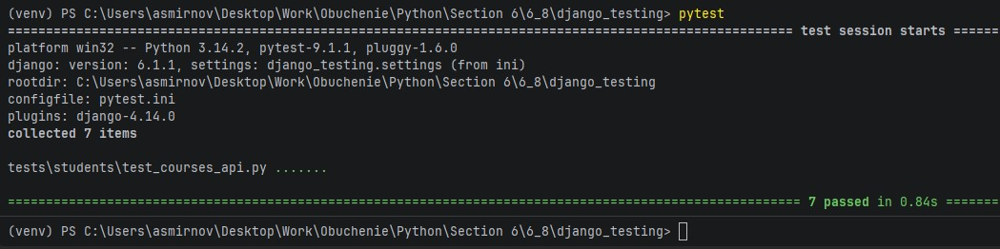

# 6.8. # Тестирование Django-приложения. - Андрей Смирнов.

## Описание

Есть бэкенд простого приложения с курсами и списком студентов. Вся логика для бэкенда уже есть в заготовке, но совершенно нет тестов.

## Что нужно сделать

Вам необходимо написать тесты для текущей логики приложения.

Заведите фикстуры:

- для api-client,
- для фабрики курсов,
- для фабрики студентов.

В качестве библиотеки для фабрик используйте `model_bakery` (https://github.com/model-bakers/model_bakery).

Добавьте следующие тест-кейсы:

- проверка получения первого курса (retrieve-логика):
  - создаем курс через фабрику;
  - строим урл и делаем запрос через тестовый клиент;
  - проверяем, что вернулся именно тот курс, который запрашивали;
- проверка получения списка курсов (list-логика):
  - аналогично — сначала вызываем фабрики, затем делаем запрос и проверяем результат;
- проверка фильтрации списка курсов по `id`:
  - создаем курсы через фабрику, передать ID одного курса в фильтр, проверить результат запроса с фильтром;
- проверка фильтрации списка курсов по `name`;
- тест успешного создания курса:
  - здесь фабрика не нужна, готовим JSON-данные и создаём курс;
- тест успешного обновления курса:
  - сначала через фабрику создаём, потом обновляем JSON-данными;
- тест успешного удаления курса.

Все тесты должны явно проверять код возврата.

Не забывайте использовать декоратор `@pytest.mark.django_db`, чтобы тесты использовали базу.

Запуск тестов делается через команду:

```
$ pytest
```

Перед началом работы убедитесь, что все зависимости установлены (dev-зависимости указаны в `requirements-dev.txt`) и тесты успешно запускаются. Вы должны увидеть:

```
$ pytest
======== test session starts =====

...
collected 1 item

tests/students/test_courses_api.py F                                                                                                                                          [100%]

====== FAILURES ====
_____ test_example ____

    def test_example():
>       assert False, "Just test example"
E       AssertionError: Just test example
E       assert False

tests/students/test_courses_api.py:2: AssertionError
=== short test summary info ===
FAILED tests/students/test_courses_api.py::test_example - AssertionError: Just test example
===== 1 failed in 0.21s =====
```

Этот тест можете удалить и написать в этом файле свои тесты.

## Подсказки

- `APIClient` в DRF является расширением Джанговского `Client`. Для того, чтобы передать GET-параметры в запросе, используйте аргумент `data`: https://docs.djangoproject.com/en/3.1/topics/testing/tools/#django.test.Client.get.

## Документация

pytest: https://docs.pytest.org/en/stable/

pytest-django: https://pytest-django.readthedocs.io/en/latest/

тестирование DRF: https://www.django-rest-framework.org/api-guide/testing/

## Дополнительные задания (необязательные для выполнения)

### Ограничить число студентов на курсе

Добавьте валидацию на максимальное число студентов на курсе — 20. Подумайте, как протестировать это ограничение, не создавая 20 сущностей в базе данных.

**Подсказка:** задайте максимальное число студентов в `settings.py`: `MAX_STUDENTS_PER_COURSE`. В тестах используйте `parametrize` и фикстуру `settings` (https://pytest-django.readthedocs.io/en/latest/helpers.html#settings), чтобы переопределить параметр.

Протестируйте как неудачный исход, так и успешный.

## Документация по проекту

Для запуска проекта необходимо

Установить зависимости:

```bash
pip install -r requirements-dev.txt
```

Вам необходимо будет создать базу в postgres и прогнать миграции:

```base
manage.py migrate
```

Выполнить команду:

```bash
pytest
```

------


### Ответ:

Изменения в прокте были выполнены в следующих файлах - `tests/conftest.py` и `tests/students/test_courses_api.py`


Содержимое `tests/conftest.py` и сам файл [conftest.py](./assets/6_8/conftest.py):

```python
import pytest
from rest_framework.test import APIClient
from model_bakery import baker

from students.models import Course, Student


@pytest.fixture
def api_client():
    """Фикстура для тестового клиента DRF."""
    return APIClient()


@pytest.fixture
def course_factory():
    """Фикстура-фабрика для создания курсов через model_bakery."""
    def factory(*args, **kwargs):
        return baker.make(Course, *args, **kwargs)
    return factory


@pytest.fixture
def student_factory():
    """Фикстура-фабрика для создания студентов через model_bakery."""
    def factory(*args, **kwargs):
        return baker.make(Student, *args, **kwargs)
    return factory
```


Содержимое `tests/students/test_courses_api.py` и сам файл [test_courses_api.py](./assets/6_8/test_courses_api.py):

```python
import pytest
from django.urls import reverse
from rest_framework import status

from students.models import Course


@pytest.mark.django_db
def test_retrieve_course(api_client, course_factory):
    """Проверка получения одного курса (retrieve)."""
    course = course_factory()
    url = reverse('courses-detail', args=[course.id])
    response = api_client.get(url)
    assert response.status_code == status.HTTP_200_OK
    assert response.data['id'] == course.id
    assert response.data['name'] == course.name


@pytest.mark.django_db
def test_list_courses(api_client, course_factory):
    """Проверка получения списка курсов (list)."""
    courses = course_factory(_quantity=3)
    url = reverse('courses-list')
    response = api_client.get(url)
    assert response.status_code == status.HTTP_200_OK
    assert len(response.data) == len(courses)
    returned_ids = {item['id'] for item in response.data}
    expected_ids = {course.id for course in courses}
    assert returned_ids == expected_ids


@pytest.mark.django_db
def test_filter_courses_by_id(api_client, course_factory):
    """Проверка фильтрации списка курсов по id."""
    courses = course_factory(_quantity=5)
    target_course = courses[0]
    url = reverse('courses-list')
    response = api_client.get(url, data={'id': target_course.id})
    assert response.status_code == status.HTTP_200_OK
    assert len(response.data) == 1
    assert response.data[0]['id'] == target_course.id


@pytest.mark.django_db
def test_filter_courses_by_name(api_client, course_factory):
    """Проверка фильтрации списка курсов по name."""
    course_factory(name='Python')
    course_factory(name='Django')
    course_factory(name='JavaScript')
    url = reverse('courses-list')
    response = api_client.get(url, data={'name': 'Django'})
    assert response.status_code == status.HTTP_200_OK
    assert len(response.data) == 1
    assert response.data[0]['name'] == 'Django'


@pytest.mark.django_db
def test_create_course(api_client):
    """Тест успешного создания курса."""
    data = {
        'name': 'Новый курс',
    }
    url = reverse('courses-list')
    response = api_client.post(url, data=data, format='json')
    assert response.status_code == status.HTTP_201_CREATED
    assert Course.objects.filter(name='Новый курс').exists()


@pytest.mark.django_db
def test_update_course(api_client, course_factory):
    """Тест успешного обновления курса."""
    course = course_factory()
    data = {
        'name': 'Обновлённое имя',
    }
    url = reverse('courses-detail', args=[course.id])
    response = api_client.put(url, data=data, format='json')
    assert response.status_code == status.HTTP_200_OK
    course.refresh_from_db()
    assert course.name == 'Обновлённое имя'


@pytest.mark.django_db
def test_delete_course(api_client, course_factory):
    """Тест успешного удаления курса."""
    course = course_factory()
    url = reverse('courses-detail', args=[course.id])
    response = api_client.delete(url)
    assert response.status_code == status.HTTP_204_NO_CONTENT
    assert not Course.objects.filter(id=course.id).exists()
```


Результат прогона тестов:


